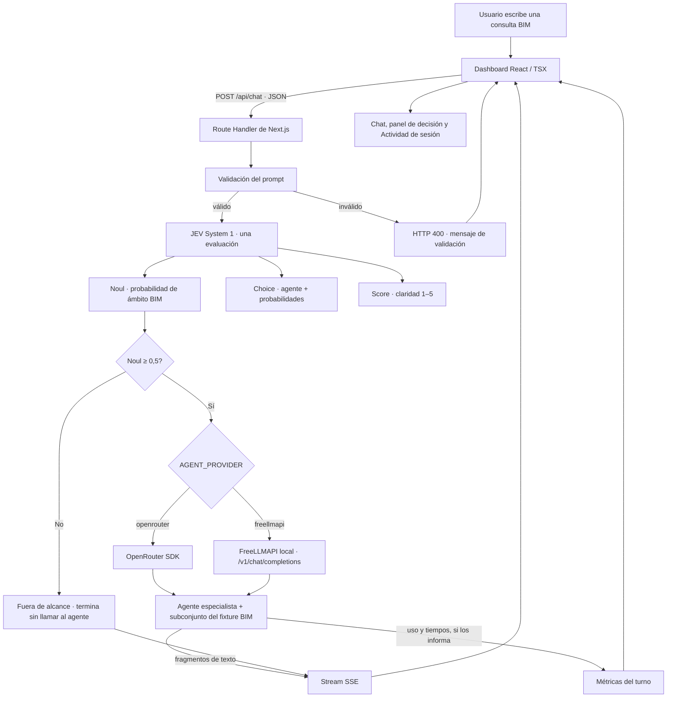

# BIMrouter

PoC local de routing de agentes BIM. JEV System 1 decide qué agente debe atender cada consulta; el agente responde con OpenRouter o con una instancia local de FreeLLMAPI usando datos BIM simulados.

La interfaz permite demostrar el recorrido en un chat y consultar, por turno, la decisión de JEV, el agente asignado, el proveedor y las métricas disponibles. No se conecta a modelos BIM reales ni conserva historial al cerrar la sesión.

## Stack y lenguajes

| Parte | Tecnología | Uso |
| --- | --- | --- |
| Aplicación web | Next.js App Router 16 + React 19 | Páginas del dashboard y endpoint del chat. |
| Lenguaje principal | TypeScript 5 | Tipos del dominio, router, adaptadores y lógica del servidor. |
| Interfaz | TSX + CSS | Componentes React y estilos propios en `app/globals.css`; no usa un framework CSS. |
| Runtime | Node.js 22.18+ | Servidor Next.js y runner de pruebas. |
| Decisión | `@typesafe-ai/sdk` | Una evaluación JEV System 1 con `Noul`, `Choice` y `Score`. |
| Agentes | `@openrouter/sdk` y `fetch` | OpenRouter mediante SDK y FreeLLMAPI por su API compatible con OpenAI. |
| Streaming | Server-Sent Events (SSE) | Lleva decisión, fragmentos, métricas y errores del servidor al navegador. |
| Modelo BIM | Fixture local en TypeScript | Edificio de demostración simulado, con niveles, espacios, instalaciones, cantidades e interferencias. |
| Empaquetado | Docker Compose | Arranque local como contenedor; no hace falta para usar `npm run dev`. |

También hay HTML autónomo para el diagrama (`public/flow.html`), YAML para Docker Compose, JSON para la configuración de paquetes y scripts Bash para los comandos de desarrollo.

## Arquitectura y flujo



El mismo flujo está disponible como diagrama HTML en [public/flow.html](public/flow.html) y, al ejecutar la aplicación, en [http://localhost:3000/flow.html](http://localhost:3000/flow.html).

### Qué pasa en una solicitud

1. El navegador envía el texto a `POST /api/chat`; el Route Handler limita y valida el prompt.
2. `routeWithJev` envía a JEV una sola evaluación que contiene las tres primitivas oficiales: `Noul` clasifica el ámbito BIM, `Choice` selecciona una de las seis áreas y devuelve probabilidades, y `Score` puntúa la claridad.
3. La aplicación registra la decisión y aplica el umbral. Con `Noul < 0,5` explica que la consulta está fuera de alcance y no llama al proveedor de agentes.
4. Si se acepta, `AGENT_PROVIDER` selecciona OpenRouter o FreeLLMAPI. El agente especialista recibe el prompt y solo el contexto pertinente del fixture BIM.
5. El servidor envía el texto progresivamente como eventos SSE. Al completarse, envía las métricas que el proveedor haya informado. Los fallos aparecen como errores; no hay respuesta sintética ni fallback a otro proveedor.

Áreas de `Choice`: modelo general, interferencias, cantidades, arquitectura y planos, estructura e instalaciones MEP.

## Datos recopilados y lectura de métricas

El dashboard mantiene cada solicitud en memoria de la sesión del navegador. La página **Actividad** presenta una fila por turno; los agregados se calculan a partir de esos turnos, no desde logs históricos ni una base de datos.

| Dato por turno | De dónde sale | Cómo interpretarlo |
| --- | --- | --- |
| Prompt, estado y agente asignado | Aplicación + `Choice` de JEV | Permite seguir qué consulta se procesó y qué especialidad fue seleccionada. |
| Probabilidades de agentes y confianza | Resultado de `Choice` | Muestra cómo se distribuyó la elección entre las seis opciones. No son métricas de calidad de respuesta. |
| Probabilidad BIM | Resultado de `Noul` | Se compara con el umbral fijo de 0,5 para continuar o detenerse. |
| Claridad y leyenda | Resultado de `Score` | Escala informativa de 1 a 5; no bloquea la ruta. |
| Tokens de entrada y salida JEV | `result.usage` de TypeSafe/JEV | Uso informado por la evaluación de decisión. |
| Proveedor y modelo del agente | Configuración y respuesta del proveedor | Identifica qué backend respondió; FreeLLMAPI puede devolver el modelo encaminado mediante `X-Routed-Via`. |
| Tokens del agente | Uso reportado por OpenRouter/FreeLLMAPI | Si el proveedor no los envía, aparecen como **No informado**; la app no estima ni inventa cantidades. |
| Latencia JEV | Cronómetro del servidor alrededor de la decisión | Tiempo de la evaluación JEV, en milisegundos. |
| Primer fragmento | Cronómetro hasta el primer texto del agente | Aproxima cuánto esperó el usuario antes de ver la respuesta comenzar. |
| Duración del agente y extremo a extremo | Cronómetros del servidor | Separan la generación de la duración total, incluida la decisión JEV. |

Los totales de tokens y el tiempo medio se agregan para la sesión abierta. Un prompt rechazado puede tener métricas JEV y tiempo total, pero no tiene consumo del agente porque el proveedor no se invoca. Al reiniciar o cerrar la sesión del navegador, se pierde el historial. No se registran claves ni se escriben turnos en disco.

## Inicio local

Requisitos: Node.js 22.18 o superior, una clave TypeSafe/JEV y la clave del proveedor de agentes que se vaya a utilizar.

```bash
npm install
cp .env.example .env.local
```

Edita `.env.local` y completa las credenciales. Selecciona **un** proveedor para los agentes:

```dotenv
TYPESAFE_API_KEY=tu_clave_typesafe

# Opción A: OpenRouter
AGENT_PROVIDER=openrouter
OPENROUTER_API_KEY=tu_clave_openrouter
OPENROUTER_MODEL=openrouter/free

# Opción B: FreeLLMAPI local (usa AGENT_PROVIDER=freellmapi)
FREELLMAPI_BASE_URL=http://localhost:3001/v1
FREELLMAPI_API_KEY=tu_clave_freellmapi
FREELLMAPI_MODEL=auto
```

FreeLLMAPI debe estar escuchando localmente en el puerto 3001. Las claves y URL se leen en el servidor y no se envían al navegador. `.env.local` está excluido de Git.

```bash
npm run dev
```

Abre [http://localhost:3000](http://localhost:3000). Para cambiar de proveedor, modifica `AGENT_PROVIDER` y reinicia el servidor de desarrollo.

## Estructura del proyecto

```text
app/
  api/chat/route.ts        Validación, JEV, umbral y respuesta SSE
  actividad/page.tsx       Tabla de turnos y métricas de sesión
  bim/page.tsx             Visor de datos BIM simulados
src/
  components/              Dashboard, navegación y estado de sesión React
  lib/agent-provider.ts    Selector de proveedor basado en entorno
  lib/freellmapi.ts        Adaptador local compatible con OpenAI y SSE
  lib/openrouter.ts        Adaptador SDK de OpenRouter
  lib/jev.ts               Decisión System 1 y primitivas JEV
  lib/bim-fixture.ts       Dataset local del edificio de demostración
  lib/domain.ts            Tipos compartidos de agentes, métricas y eventos
public/flow.html           Diagrama de flujo independiente
docs/                      Specs y decisiones de arquitectura (ADR)
tests/                     Pruebas locales de fixture y validación
```

## Comandos

```bash
npm run dev        # servidor local de desarrollo
npm run build      # build de producción
npm start          # servir el build de producción
npm run lint       # ESLint
npm run typecheck  # comprobación de TypeScript
npm test           # suite automatizada de Node.js
```

La suite local no necesita claves ni servicios externos.

## Docker Compose

Docker Engine y Compose permiten ejecutar la PoC en contenedor. Copia el ejemplo y completa `TYPESAFE_API_KEY` y la clave del proveedor seleccionado en `.env`:

```bash
cp .env.example .env
docker compose up --build -d
```

Para FreeLLMAPI en el host, Compose usa `http://host.docker.internal:3001/v1` por defecto; puede cambiarse mediante `FREELLMAPI_DOCKER_BASE_URL`. Para detener:

```bash
docker compose down
```

Compose publica el dashboard solo en loopback. Las claves se inyectan en tiempo de ejecución, no se incluyen en la imagen y `.env` está excluido de Git y Docker.

## Alcance y límites

- **BIM simulado:** respuestas basadas en `src/lib/bim-fixture.ts`; no lee RVT, IFC ni otros modelos reales.
- **Sesión efímera:** sin cuenta, servidor de historial ni base de datos.
- **Proveedores en vivo:** JEV se llama por API. Para agentes, se usa el proveedor seleccionado; los errores se muestran y no se sustituyen por salidas ficticias.
- **Métricas honestas:** tokens solo cuando el proveedor los reporta; los tiempos se miden en el servidor.

## Referencias

- [API y SDK de TypeSafe/JEV](https://docs.typesafe.ai/sdk/javascript)
- [SDK TypeScript de OpenRouter](https://openrouter.ai/docs/client-sdks/typescript/overview)
- [API de FreeLLMAPI](https://github.com/tashfeenahmed/freellmapi/blob/main/docs/en/api/01-rest-api.md)
- [Route Handlers de Next.js](https://nextjs.org/docs/app/getting-started/route-handlers)
